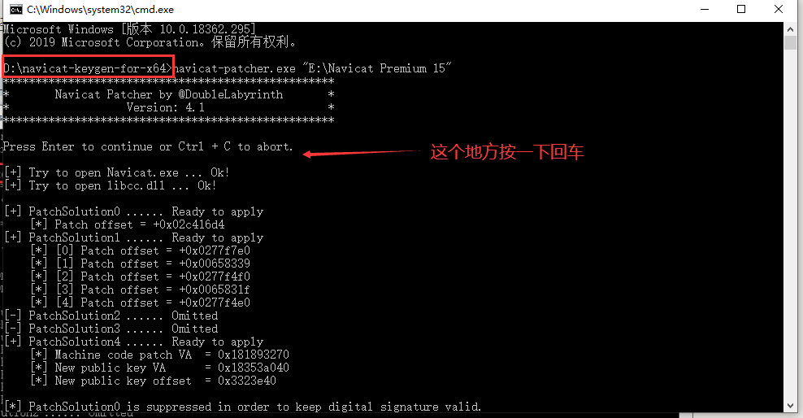
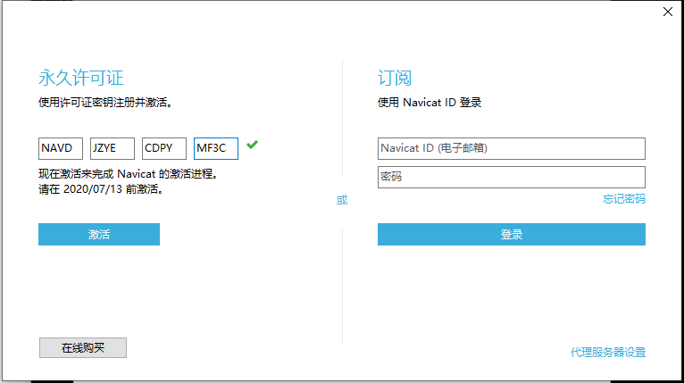
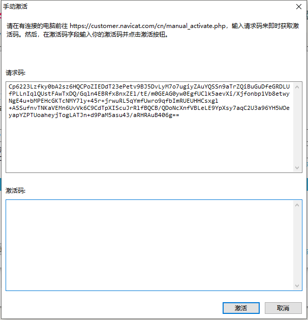

# Navicat-key
激活Windows 版的 Navicat 教程

## 首先从官网下载Navicat

[下载地址]( https://www.navicat.com.cn/products ) 下载完安装即可

## 激活

### 然后根据自己电脑的版本下载激活工具

电脑是64位的就下载 `navicat-keygen-for-x64.zip` ， 32位的下载另一个， 下载完解压，记住解压的路径。

### 激活码

打开cmd, 进入刚刚解压的路径，我解压的路径是 `D:\navicat-keygen-for-x64` 。

然后执行命令 `navicat-patcher.exe "E:\Navicat Premium 15"` 

这个`E:\Navicat Premium 15` 要替换成你自己的Navicat Premium的安装路径 。 

然后再执行命令`navicat-keygen.exe -text .\RegPrivateKey.pem` 

然后输入编号选择你下载的Navicat的具体版本，然后选择语言。最后选择版本号，我的是 15 。后面的name和organization 自己随便输。

**把`Serial number` 给复制下来，而且这个cmd窗口不要关闭，此时断开网络**，打开刚刚安装的Navicat，点击注册，把`Serial number` 粘贴上去。

点击激活，在点击手动激活。复制请求码。

再次打开刚刚的cmd窗口，把刚刚的请求码粘贴上去。按两次回车(产生一个空行)，就会得到一个`Activation Code`, 把这个码粘贴到刚刚激活码的地方，点击激活即可。

